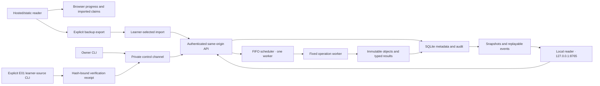

# Cross-section integration contract

Status: NORMATIVE TARGET, specification revision 1.0. This document binds the joins between learner actions, runtime requests, artifact identity, and acceptance. It does not report product execution. Conflicting prose/schema/fixture bytes are a specification defect; they are not a choice offered to an implementer.

## INT-001 — Bind each operation to its effects
The reader MUST use the following operation distinctions everywhere, including setup, review, monitor, results, notes, and export.

| Learner action | Operation | Reads | Changes | Durable evidence |
|---|---|---|---|---|
| Train tokenizer | tokenizer_train | eligible train text | merge rules only | tokenizer JSON/digest and creating job |
| Train TinyLM | tiny_train | fixed tokenizer, eligible train/validation | new random-initialized model and optimizer | run, metrics, safe checkpoints |
| Resume TinyLM | tiny_resume | safe model/optimizer/RNG checkpoint | child model/optimizer | parent link and child run |
| Evaluate | evaluate | selected immutable subjects and split | measurements only | protocol, complete record IDs, raw outputs and aggregates |
| Prepare model | model_prepare | pinned safe remote bytes | verified local cache/registry | download manifest and model ID |
| Train adapter | adapter_train | frozen base and train/validation | LoRA parameters and optimizer only | adapter run/checkpoints and frozen-base checks |
| Resume adapter | adapter_resume | base plus complete adapter resume state | child adapter/optimizer | parent link and restored-state evidence |
| Preview model context | context_preview | tokenizer/template, subject identity, proposed request | preview artifact only | exact serialization, crop/drop decisions and request digest |
| Prompt and continue | generate | tiny checkpoint and matching preview | output artifact only | prompt, new token IDs/text, seed and checkpoint |
| Send chat message | chat_generate | base/adapter and matching preview | output artifact only | serialized context, generated tokens and subject |
| Build/query retrieval | retrieval_build / retrieval_query | corpus/index | immutable index or ranked-hit artifact | TF-IDF identity and exact retrieved IDs |
| Export / validate / import | export_bundle / validate_bundle / import_bundle | selected objects/archive | copy / validation record / imported logical identities | manifest, validation facts and import map |

Conversation history is committed by its explicit revision-checked API action after generation; generating alone does not mutate a conversation. Neither history commit nor context preview trains a model. A legacy .pt record is not a portable v2 checkpoint.

## INT-002 — Join screens, APIs, and durable state
The OpenAPI document MUST contain a callable path for each local action below; the UI MUST NOT invent a successful local state before its response is committed.

| Surface/action | Contract boundary | Persisted state |
|---|---|---|
| Pair/reconnect | sessions; runtime; preflight | session in sessionStorage only; preflight receipt |
| Data Source/Inspect/Split | strict browser inspection; fixed group allocation | unsent form state only |
| Save audited dataset | POST datasets with metadata and split files | manifest, audit, split objects; audit-only allowed |
| Review/submit/cancel job | jobs; cancellation; events/snapshot | immutable request, state events, typed result |
| Select tokenizer/checkpoint | tokenizer/model/checkpoint registries | exact ID and digest, never display-name identity |
| Preview then generate | context_preview then generate/chat_generate | preview and output bound to identical effective request |
| Save progress | progress module update with revision | independent dimension and timestamp |
| Save/delete note | notes with revision; deletion preview/confirmation | revision history or tombstone |
| Save chat history | conversations and generation commit with revision | subject-bound turns and generation artifact IDs |
| Export chat as data | explicit conversation export | inert dataset-candidate artifact, later ordinary import/audit |
| Verify evidence | evidence verification profile | immutable digest-bound facts, not prose grade |
| Assess reasoning | evidence assessments | identified review kind, rubric rows and derived decision |
| Begin/finalize capstone | capstone attempt; paired evaluate token | freeze, exposure ledger, consumed state, paired artifact |
| Backup/import learning state | backup export; progress import preview/apply | explicit selected backup and atomic merge |
| Reuse model bundle | bundle upload; validate_bundle; import_bundle | imported IDs and preserved source identity |

The diagram has no hosted-reader-to-loopback execution edge. E01 source execution remains in its explicitly invoked CLI; the worker executes only installed operation modules.

Browser inspection is preliminary. Final dataset eligibility comes from the companion's revalidation of uploaded bytes. Group splitting is explicit, deterministic, and represented in the submitted split files; a browser cannot mark an unaudited selection eligible.

## INT-003 — Define the TinyLM v2 mechanics
tiny-v2-standard-v1 MUST preserve the untied architecture, initialization, forward/target contract and pure byte/BPE algorithm of the protected [model.py](../../../course/labs/model.py), [data.py](../../../course/labs/data.py), and [tokenizer.py](../../../course/labs/tokenizer.py). These source bytes are bound by SCP-001. The companion refactor changes custody/instrumentation and adds named protocols; it MUST NOT silently replace attention, LayerNorm, GELU, learned positions or the optimizer.

The standard model has token embedding V by W, learned position embedding C by W, L pre-norm blocks, biased QKV and attention-output projections, width-4W GELU MLP, final LayerNorm, and an untied biasless output W to V. There is no dropout, rotary position, RMSNorm, cache or mixed precision. Unique trainable scalar count is 2VW + CW + L(12W² + 13W) + 2W. Tied variant subtracts VW and follows APP-014. The default lesson configuration is V=257/C=64/W=64/H=4/L=2, batch 8, learning rate0.0003, seed 17; a preset overrides only explicitly named fields.

Tokenizer training reads train only in stored record order. Vocabulary request257 returns the byte tokenizer with zero merges; greater values use protected deterministic pair counts/ties, stopping early if no pair has count 2. Actual vocabulary may be below the requested size and MUST be reported. Seed is retained as request metadata but does not alter this deterministic BPE algorithm. EOS is 256; merges start 257; fingerprint uses the protected tokenizer's exact serialization, not a new compact-JSON digest.

Training concatenates each ordered record's token IDs followed by EOS, independently for train/validation, and requires each stream longer than C. A CPU Torch generator seeded with the run seed samples starts uniformly exactly as protected batch(). Targets are shifted once by the loader. AdamW uses lr from request, betas0.9/0.999, eps1e-8, weight_decay0.01; zero_grad(set_to_none=True), scalar mean token cross-entropy, backward, global L2 gradient clipping1.0 with error_if_nonfinite=True, optimizer step. No scheduler, warmup, accumulation, augmentation or shuffle beyond sampled starts is added.

Before initialization, set Python random seed and torch.manual_seed, Torch intra-op and inter-op thread counts to1, deterministic algorithms on; CUDA sets CUBLAS_WORKSPACE_CONFIG=:4096:8 before Torch import and disables TF32/cudnn benchmarking. An unsupported deterministic operation fails explicitly. Record exact device/profile/lock; no cross-profile equality claim.

Training metrics at initial step 0, each global update divisible by eval_every, and final update use the protected eight fixed sampled batches per split with seed+1000. Resumed initial measurement at the saved global step does not update weights or consume batch RNG. Select lowest validation token NLL, tie earliest global step; inherit the parent's incumbent. Train and validation values retain units nats/token and MUST NOT be mixed with the separate byte-normalized protocol. Each update's gradient diagnostics are retained in the bounded metric artifact; the event stream follows RUN-011 cardinality rather than emitting an unbounded event per diagnostic field.

## INT-004 — Serialize TinyLM checkpoints without pickle
Tiny-v2 checkpoint payload MUST contain model.safetensors, optimizer.safetensors, rng.safetensors, tokenizer.json, config.json, trainer_state.json and manifest.json. Manifest lists every other file with exact size/SHA-256 and format tiny-v2-checkpoint-v1. No executable or pickle format is permitted.

model.safetensors contains named state_dict tensors, including attention mask buffers; the tied variant writes shared storage once and declares the APP-014 alias. optimizer.safetensors stores exp_avg and exp_avg_sq under stable parameter names; trainer_state.json stores each parameter's integer AdamW step, ordered parameter groups/settings, completed global step, requested final step, eval_every, batch size, seed, incumbent best checkpoint ID/loss/step, dataset split identities, tokenizer digest, architecture profile/variant, profile/device and lock digest. rng.safetensors stores batch CPU generator, Torch CPU generator and per-selected-CUDA-device RNG byte tensors with explicit names. Python RNG state, if used, is integer-only JSON with exactly the version/state/gauss representation, never executable deserialization.

Load MUST validate files, tensor names/shapes/dtypes, aliases and identities before constructing effective model/optimizer state. Unknown/missing tensors, a nonfinite incumbent, wrong dataset/tokenizer/config/lock/profile, unsupported version, or step overflow rejects load. Initial incumbent is represented by null before the first validation; infinity is never JSON. Validation loss is finite after initial evaluation.

Each saved boundary receives a new checkpoint ID. latest and best are registry references, not mutable files. Resume inherits all state except additional_steps; device/profile changes are rejected. Global final step equals parent step plus additional_steps and cannot exceed 2,147,483,647. A 25+25 resumed control MUST match an uninterrupted50 run's tensors, batch RNG, fixed validation values and greedy token IDs on the same qualified profile. Times, paths, job IDs and artifact IDs are intentionally different.

E01's explicit learner-source CLI is distinct from the fixed worker. A successful hash-bound verification receipt permits the built-in tied training profile and is referenced by its run; the web worker never executes the learner's patch. This verifies the submitted modification and separately trains the equivalent specified built-in variant. No operating-system sandbox for learner code is claimed.

## INT-005 — Define complete byte-normalized evaluation
tiny-nll-per-byte-v1 is a teacher-forced full-split protocol, distinct from the eight-window training monitor. Sort records by record_id in Unicode code-point order. For a record with tokenization [t0,...,t(m-1)], begin history with EOS256. For each target in [t0,...,t(m-1),EOS256], feed at most the final C history tokens to model.eval() under inference_mode, compute log_softmax of the final position's logits in float64, accumulate negative log probability of the target, then append that target to history. Learned positions restart0 for each cropped model call. There is no cross-record history, sampling, skipped first token, batching-dependent padding or target truncation.

utf8_bytes is the strict UTF-8 length of original record text, excluding JSON framing and EOS. token_count is m+1 and includes the scored EOS. The denominator is bytes, not token_count. Empty/whitespace-only records are rejected during registration. Report each finite NLL, byte count, ratio, and the aggregate sum(NLL)/sum(bytes), not the mean of record ratios. Per-record and aggregate sum order is fixed record/target order; float64 accumulation tolerance is absolute1e-12 for fixture arithmetic and absolute1e-6 for same-profile model comparisons. EOS scoring is part of this protocol; the value is not claimed to be a universal benchmark.

The arithmetic fixture is records A:NLL6/bytes3, B:NLL4/bytes8: aggregate10/11, while mean of ratios1.25 is incorrect. A uniform V=257 logits fixture scores each target at ln257; a one-byte record containing one byte token plus EOS has NLL2ln257 and byte denominator1. BPE comparison requires same original record bytes and this identical EOS/history protocol.

## INT-006 — Freeze preview and decoding semantics
Every interactive generate/chat request MUST reference its matching context-preview artifact. Context preview executes tokenizer/template work in the fixed worker, uses the same queue/authentication/bounds, and never loads or changes learned weights. Its canonical-request digest excludes preview_artifact_id and context_preview_digest and binds every subject identity, prompt/message byte, decoding field and effective profile. The consumer revalidates subject/tokenizer/template digests; mismatch returns CONTEXT_PREVIEW_STALE before inference. Evaluation uses its frozen protocol internally and requires no interactive preview.

Tiny continuation encodes the nonempty prompt without EOS and previews the final C tokens used for the first step, original count and left-cropped count. Subsequent steps feed the final C tokens of prompt plus already generated tokens. Prompt bytes are displayed separately from new output. Tiny top-p is greater than0 through1; temperature0 requires top-p1. Positive-temperature decoding divides logits by temperature, sorts probabilities descending with token ID ascending for ties, retains the smallest prefix whose cumulative probability is at least top_p, renormalizes, and samples with a job-local generator. Greedy chooses lowest ID among exact maximum logits. EOS stops before adding it to visible text but remains in generated token IDs/count. Stop reason is eos, length or cancelled; decode uses UTF-8 replacement for invalid generated byte sequences and reports replacement occurrence. Input tokenization round-trip uses strict decoding.

Applied context/template/decoding uses APP-004 and APP-009/010. No browser estimates pretrained token count by character length. Preview UI labels executed tokenizer work distinctly from model inference. All matching preview artifacts remain provenance records even if the learner never sends the generation.

## INT-007 — Enforce numeric limits at their actual boundary
All limits are inclusive. KiB/MiB/GiB mean powers of 1024. UTF-8 byte checks occur after strict decoding but before acceptance; Unicode scalar counts reject lone surrogates. JSON Schema maxLength is a scalar bound, not proof of a byte bound. Enforce the byte rule separately. At limit+1 reject before job/registry mutation unless a row explicitly defines display truncation.

| Boundary | Maximum or fixed bound | Rejection/result |
|---|---|---|
| Ordinary API JSON body |1MiB bytes; no content encoding |413 PAYLOAD_TOO_LARGE |
| Dataset upload |3 split files;10MiB each;30MiB combined;100,000 total records |413 PAYLOAD_TOO_LARGE; zero registration |
| Tiny/tokenizer parsed training text |200,000 UTF-8 bytes |400 VALIDATION_FAILED, reason PAYLOAD_TOO_LARGE |
| Applied parsed SFT content |20MiB UTF-8 bytes |400 VALIDATION_FAILED, reason PAYLOAD_TOO_LARGE |
| Tiny architecture |context8..512;width16..512;heads1..16;layers1..12;batch1..64;P<=10,000,000 |400 VALIDATION_FAILED |
| Tiny updates |1..2000 per job; global step<=2,147,483,647 |400 VALIDATION_FAILED |
| Adapter updates |1..120 per job and lineage cumulative<=120 |400 VALIDATION_FAILED, reason ADAPTER_UPDATE_LIMIT |
| Tiny prompt/output |16,384 UTF-8 input bytes;1..512 new tokens |400 VALIDATION_FAILED |
| Chat request |1..64 messages;8192 bytes each;32768 content bytes total;1..128 new tokens |400 VALIDATION_FAILED |
| Applied effective context |512 including generated-token budget |400 VALIDATION_FAILED, reason CONTEXT_TOO_LONG |
| Retrieval |query4096 UTF-8 bytes;top_k1..20;max_features100..20000 |400 VALIDATION_FAILED |
| Text artifact preview |262,144 bytes |larger safe text is download-only; no clipped pseudo-complete preview |
| Notebook |5 fields <=20,000 scalars each;8 links each module/dataset/run/checkpoint;16 artifact links |400 VALIDATION_FAILED |
| Evidence/assessment text |32 artifact links;10 assessments/evidence;claim/rationale20,000 scalars;reviewerID/name120 |400 VALIDATION_FAILED |
| Conversation storage |200 turns;1MiB total UTF-8 content |409 REGISTRY_LIMIT; current revision unchanged |
| Learning-state JSON |v2 wrapper8MiB; plain progress1MiB; legacy format retains original decimal1,000,000-byte limit |413 BACKUP_TOO_LARGE on export;413 PAYLOAD_TOO_LARGE on import |
| Static sidecar |4MiB measured as2*serializedJSstring.length;100 live notes |local save rejects with storage message; existing bytes unchanged |
| Bundle |1GiB archive;2GiB expanded;10,000 entries;512MiB/entry;240-byte path;100:1 ratio |413 PAYLOAD_TOO_LARGE or400 VALIDATION_FAILED/ARCHIVE_UNSAFE |
| Job queue |1 active worker;8 queued |429 QUEUE_FULL |
| Worker deadline/cancel |60min from starting;30sec cooperative shutdown |interrupted/timeout; latest durable boundary only |
| Teaching hold |step 25;10min |interrupted/exercise_timeout on expiry |
| Job events |4096; closed cardinalities in RUN-011 |WORKER_PROTOCOL_ERROR with terminal reserve |
| Worker stdout/stderr |1MiB each |retain prefix; explicit truncation warning and byte count |
| Service logs |10MiB/file;5 retained files |rotate oldest diagnostic file; never prune job/evidence records |
| Paging |100 list items;500 event rows |400 VALIDATION_FAILED |
| Root storage |50GiB committed+staging+reserved new bytes |409 REGISTRY_LIMIT before mutation |
| Registry counts |1000 datasets;50,000 jobs;20,000 runs;512 models;5000 checkpoints;100,000 artifacts |409 REGISTRY_LIMIT |
| Learner registry |1 progress document/24 allowed modules;1000 live notes;5000 evidence;200 live conversations;100 capstone attempts;20 active previews |409 REGISTRY_LIMIT |

Free-space reserve is 1 GiB above the estimated maximum new bytes, and root quota includes reservations for queued jobs. Tiny train/resume reserve max(512MiB, Ck*(12P+8MiB)+16MiB), where Ck=2+ceil(requested additional updates/eval_every), including initial and final-or-cancellation checkpoint allowance. The8MiB per-checkpoint overhead covers maximum attention-mask buffers, JSON metadata and RNG/optimizer scalars. Cancellation at an already durable update reuses that checkpoint and emits no duplicate checkpoint-committed event. P is unique trainable scalars; tied count excludes aliases. Adapter reserve max(1GiB, Ck*(12*460800+4MiB)+64MiB), with Ck=2+ceil(updates/preset_cadence), cadence 10 for intents and 5 for capstone. Remaining operation estimates are RUN-007. A reservation is released only after terminal commit/recovery; free-space deterioration can still fail during execution. A measured job's speed does not change any cap automatically.

## INT-008 — Use one error vocabulary and validation order
Synchronous errors use RUN's envelope with uppercase code and optional uppercase reason_code. Transport/authentication errors retain their own status. Semantic/parser/domain rejections use HTTP400 code VALIDATION_FAILED plus the exact DAT/APP reason. Resource identity/state conflicts use409 STATE_CONFLICT. A post-accept domain failure uses that uppercase domain cause directly as job.error.code; it is not reported as a synchronous rejection.

DAT's order is transport size, archive structure when applicable, encoding/JSON, schema, reference, digest, semantic invariant, eligibility. Authentication/Host/Origin/CSRF checks precede that order. Return lexically sorted field errors from the first failed stage; do not expose source text/host paths or invoke later expensive model work. A rejected acceptance request has no job, no accepted-state event and no registry revision change. An inert staging upload/preview is a separately named accepted operation and cannot be described as a zero-write validation.

Canonical request bytes use the qualified Python 3.12 call json.dumps(value, sort_keys=True, separators=(",",":"), ensure_ascii=False, allow_nan=False).encode("utf-8"), with no trailing LF and no Unicode normalization. Validate types first; preserve supplied finite number values and request strings. Service-generated request digests use this serialization consistently across preview, acceptance and idempotency; the frontend reuses the saved preview request object. Bundle manifest canonicalization retains DAT-009's separate trailing-LF rule.

Preview/create/apply tokens bind input digest and database/entity revision. Rejection does not make a stale preview valid. Repeating an accepted request with the same idempotency key and bytes returns its prior result; changing bytes under that key returns IDEMPOTENCY_CONFLICT. A client recovering across session expiry first reconciles the prior job/request, never auto-resubmits uncertain work.

## INT-009 — Keep progress, assessment, and test exposure independent
The 24 allowed module IDs are exactly P00,00..20,E01,E02. Progress has independent reading/read/practiced/self_checked flags; artifact verification and review records are separate. review_kind is exactly self or independent. An independent review requires a named human reviewer; the app records that assertion, not verified employment/identity. Imported assessments remain imported claims until a new local assessment is recorded. A rubric decision is derived from its required rows; clients cannot grant meets by sending only a total.

Static mode preserves the foundation v1 storage and uses the named intermediate sidecar for added progress/notes/claims. Migration is explicit and retains source bytes. Static code cannot execute companion artifact verification or award local execution attestation. Companion records remain authoritative for real jobs; origins exchange selected backups/bundles only.

A capstone token is consumed before test loading. The dataset-digest exposure ledger records every consumed attempt, including failure/cancellation. A replacement attempt cannot restore untouched status. New attempts freeze their own candidate/config and report fresh_test or reused_test with prior release count. Local sealing is a workflow boundary, not an anti-cheating guarantee against a learner who can read local source files. Assessors see exposure and feedback-opened-early history.

## INT-010 — Preserve complete import and reuse meaning
The archive extension is .lfbundle and the data manifest/schema is authoritative. Physical storage uses objects/<first-two-digest>/<digest>/<safe-name>, not archive entry paths. Exported IDs are historical; import returns fresh local IDs. With skip, an already imported identical source identity may satisfy a dependency through its existing local mapping; no new logical record is created for it. Missing/ambiguous dependencies reject the whole apply. With copy, fresh IDs and complete internal reference rewrites are mandatory.

Full versus thin bundles and include_resume_state are explicit choices. Inference-only adapter/tiny weights can generate but MUST reject resume with CHECKPOINT_NOT_RESUMABLE. Complete resume state includes optimizer/RNG and immutable training configuration. No loader interprets an omitted optimizer as fresh training. Imported weights stay imported provenance even when a new local generation successfully reads them.

Validation reports safe structure/digests; import registers; actual load/evaluate/generate demonstrates reuse. These are three different observations. A valid thin bundle without its exact base is labelled base_required and cannot claim offline runnable. Full-bundle qualification uses an empty root and network disabled.

## INT-011 — Ship concrete teaching inputs and verifier profiles
All deterministic fixture texts, labels, split membership, ID formulas and hashes MUST be supplied in this package's fixture definitions/materialized data. Implementers MUST NOT invent the remaining facts, create labels with a model, download another corpus or replace measured outcomes with expected-looking curves. Illustrative arithmetic, actual learner measurements, supplied recorded runs and synthetic teaching text retain distinct labels.

Every evidence verification_profile_id MUST map to the exact required fields/oracles in CUR, dataset/model identities in DAT/APP, and a named acceptance case. Verifiers check objective artifacts and arithmetic, not semantic helpfulness or reasoning prose. The root document checker validates fixture/contract correspondence only; real workers and learner assessments remain product acceptance work.

## INT-012 — Resolve amendments before qualification
The implementation MUST fail its contract checks on drift between prose, OpenAPI, schemas, fixtures or case registry. A documented amendment increments spec revision, explains old/new behavior and updates every consumer and case. No ambiguity grants the builder permission to silently choose a dependency, model, threshold, rubric or format.

The independent document review and root resolution records are retained in reviews/. Product qualification uses DEL's full case/profile/browser denominator on one frozen candidate. Document checks, source preservation and published bytes do not establish native behavior, model quality or learning effectiveness.
